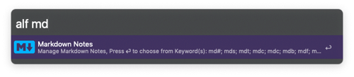
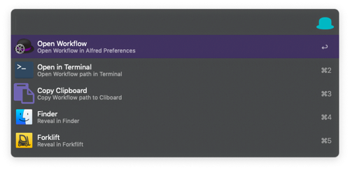

# Search-Alfred-Workflows

Search-Alfred-Workflows searches in Title, Keywords, Description of a workflow and shows avaialable keywords for direct execution. It also allows to execute addtional actions on a workflow such as open in terminal or copy worfklow path to the clipboard.

**Search with the shortcut do find the corresponding Workflow:**

**Action menu on a workflow:**

## Download

[Search-Alfred-Workflow](https://github.com/Acidham/search-alfred-workflows/releases/latest) latest release.

## Options

* `ENTER` - Shows a list of keywords in the workflow and starts the workflow with a keyword
* `SHIFT` - Shows the workflow description and associated keywords
* `CMD` - For addtional Actions:
  * Copy path to Clipboard
  * Open WF Folder in Terminal 
    * If you would like to use other terminal than macOS terminal.app change config in Alfred > Features > Terminal to custom
  * Reveal in Finder
  * Open in ForkLift (requires ForkLift installed)

## Config

Worfklows → go to “Search Alfred Workflow” → click on the`[X]` upper right corner: 

* `exclude_disabled`: True - ignore disabled workflow in search
